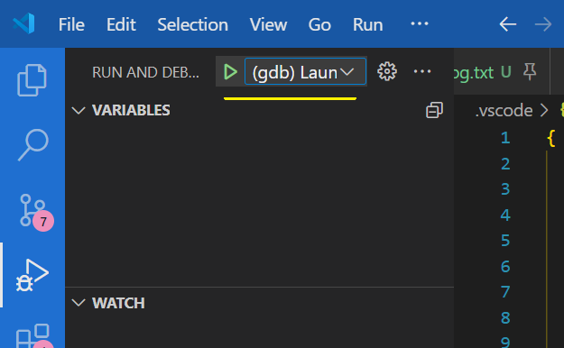

# Deepgen 项目介绍

## 1.项目背景&目录结构

### 1.1 功能

Deepgen 是一个GPU算子生成+调优工具，支持多种算子的生成和调优。可以跨多个平台执行

- 目前支持的算子：GEMM, batched GEMM
- 平台 ：NVIDIA GPU, AMDGPU, HygonDCU(Z100)

Deepgen 的自动调优支持本机运行，也支持集群运行，充分利用不同计算机资源。经过实测，在cpu负载重的工况下，torch的baseline性能会受影响，因此为了测试的严谨性，建议使用跨计算机执行，将编译和bencmark分配到不同主机上

### 1.2 目录结构

运行时目录：   
**_cache** : 缓存目录，存放程序运行时的编译器缓存文件（kernel loader&launcher的so及stubcode、benchmarkTorchEps记录   
**_dump** : 临时目录，存放MLIR生成kernel过程里·生成的bc和o文件   
**_cluster_run** : 集群运行模式下，存放从master接收到的进程启动参数，以及存放benchmark的运行结果   
**_override** : 临时存放master生成的compiler/tester进程参数文件，用于跨host执行   
**_pkls** : 运行时存放生成的kernel信息序列化后的pkl文件。perftester会根据自己的devid周期性检测对应文件夹下的pkl，反序列化之并做perftest   
**_tmp** : 其他缓存目录   

代码目录：   
**_TempCodes** : 其他code，不是项目本体代码    
**.vscode/c_cpp_properties.json** : intellisense 使用的头文件目录、宏定义    
**.vscode/launch.json** : debug配置    
**.vscode/settings.json** : 文件后缀名关联以及颜色主题    
**bin** : DeepGen编译后的库/可执行文件存放位置    
**build** : 构建目录    
**ClusterTaskConfigs** : 集群运行模式的配置文件示例    
**cmake** : MLIR使用的cmake    
**doc** : 项目文档    
**include** : MLIR后端的头文件    
**Runtime** : python runtime后端    
    |-**Runtime/kcg/loaderCCode** : 存放loader的C源码    
    |-**Runtime/kcg/Operators** : 存放Operator相关代码。后期拓展算子时在此添加算子相关代码    
    |-**Runtime/kcg/tools** : 工具脚本，不参与Runtime的实际运行    
**src** : MLIR后端源代码目录    
**src/lib** : MLIR后端源码    
**src/CMakeLists.txt** : MLIR后端CMakeLists    
**src/main.cc :** MLIR后端源码，定义了exe以及python module的接口    
**third_party** : cuda和hip的第三方头文件、bitcode、其他所需程序等    
**TuningCombs** : 存放生成好的调优空间文件    
**TuningConfigs** : 调优参数配置文件    
**ClearTemp**.sh : 清理临时目录    
**CMakeLists.txt** : 根CMakeLists文件。用户变量在这里赋值    
**Compile.sh** : 编译MLIR后端的脚本    
**config.h.in** : 用户变量模板文件    

脚本：    
**scripts/Benchmark.sh** ：单机模式启动Deepgen    
**scripts/ClearTmpKernels.py** ：删除/tmp目录下的kernel文件    
**scripts/GetCudaInfo.py** ：获取cuda的计算力和ptxas信息，用于填入CMakeLists的对应变量    
**scripts/StopBenchmark.sh** ：杀死所有DeepGen运行的进程（cluster模式下存在问题，无法杀死，只能手动kill ）    
**scripts/StartBatchTestWithCluster.sh** : 以集群模式启动Deepgen    

## 2.安装&构建&运行

### 2.1 安装第三方依赖

项目使用到的第三方依赖有：

- MLIR/LLVM(rocm) : https://gitee.com/alanturin/rocm-llvm-project , commit=9fe9db, branch=amd-staging
- pytorch(建议使用conda虚拟环境)
- CUDA/ROCM 基础环境
  对于HygonDCU以及其他有配套工具要求的平台，请安装供应商提供的pytorch或CUDA/ROCM基础环境

MLIR/LLVM compile & setup ：

```sh
cmake -G Ninja ../llvm   -DLLVM_ENABLE_PROJECTS="mlir;clang" \
   -DLLVM_BUILD_EXAMPLES=ON \
   -DLLVM_TARGETS_TO_BUILD="Native;NVPTX;AMDGPU" \
   -DCMAKE_BUILD_TYPE=Release \
   -DLLVM_ENABLE_ASSERTIONS=ON -DCMAKE_INSTALL_PREFIX=~/llvm-install
ninja -j16 & ninja install
```

### 2.2 构建

使用Compile.sh脚本编译。其中 `is_as_pymodule`表示将MLIR后端编译为库（ON）或调试用exe文件（OFF）
根路径下的 CMakeLists 说明：

```cmake
# project config
###################################################################
cmake_minimum_required(VERSION 3.15.0)
project(KernelCodeGen LANGUAGES CXX C)    # delete CUDA
set(CMAKE_BUILD_WITH_INSTALL_NAME_DIR ON)
set(CMAKE_CXX_STANDARD 17 CACHE STRING "C++ standard to conform to")    # 默认使用c++17

############################ User config #####################
set(LLVM_INSTALL_DIR "~/llvm-install")         # llvm安装目录
set(DEBUG_AMDGCN_OUTPUT_PATH "/home/xushilong/DeepGen/test.amdgcn")   # 调试用输出amdgcn的路径
set(USER_LLD_PATH "/opt/dtk/llvm/bin/ld.lld")   # ld.lld 连接器的路径
set(USER_PTXAS_PATH "/usr/local/cuda/bin//ptxas")   # ptxas的路径
set(CUDA_CAP        70)     # CUDA计算能力编号，通过 scripts/GetCudaInfo 获得
set(PTXAS_VERSION   83)     # PTXAS版本 ，通过 scripts/GetCudaInfo 获得
set(CUDA_INCLUDE_DIR "/usr/local/cuda/include")     # cuda头文件路径
set(PYTHON_CONDA_ENV_DIR "~/anaconda3/envs/triton_rocm")   # python虚拟环境路径
set(PYTHON_VERSION "3.8")           # python版本号

option(COMPILE_AS_PYMODULE "Compile kcg_compiler to DynamicLib or Exe" ON)  # 是否将DeegGen编译为so/exe（exe为debug用，发布版本中取消）
# close some warnings     编译时暂时取消部分warning。待发布时需完善代码
add_compile_options(
  -Wno-unused-function
  -Wno-unused-variable
  -Wno-unused-result
  -Wno-sign-compare
  -Wno-unused-but-set-variable
  -Wno-return-local-addr
  -Wno-parentheses
  -Wno-cast-qual
  -Wno-unused-but-set-parameter
  -Wno-deprecated-declarations
  -Wno-unused-value
  )

##########################################################################
  
```

### 2.3 参数配置&运行

1. exe模式【仅用于debug】
   参数配置：debug用，只能用固定参数配置，在 src/main.cc 的 `main()`函数中修改。只用于测试MLIR后端的代码生成过程，不进行kernel的执行
   运行：

```sh
${project_folder}/bin/kcg_compiler > log.txt 2>&1
```

调试：f5进入调式模式。配置文件在 .vscode/launch.json 注意配置选择

<p align = 'center'>

</p>

2. lib模式

启动脚本为 ${project_dir}/scripts/Benchmark.sh
其调用 Runtime/kcg/deepGenMain.py ,开启进程池处理编译和测试任务。可以将该进程设置为会话分离的（nohup），即ssh链接断开后也不会停止，用于长时间跑测试
需要查看总体运行时间，执行 ：

```shell
ps -eo pid,etime,cmd | grep testGetKernels
```

## 3. 使用说明

### 3.1 运行机制

1. DeepGen首先读取用户的调优参数文件，生成并剪枝调优空间，存储到json文件。如果检测到调优空间json已存在，则跳过这步
2. 随后DeepGen根据参数空间json开始编译和benchmark。编译的进程池大小由用户决定。benchmark过程由守护进程（ perfmonitor ）和 工作进程（perftester）构成。perftester 执行测试，并将结果存入 `perfPAth` 为前缀指定的json中。
   perfmonitor 检测到 perftester 意外退出时，会重启perftester进程. perftester会根据用户输入的 `perfPAth` 路径重新读取历史最佳纪录，继续统计并benchmark，直到正常结束
3. 注意：对于大部分GPU设备，其存在自动调节时钟频率的功能，在负载情况不同时时钟频率也不同。这可能使最终性能的测定不准确，因此需要锁定频率后再测试：对于nvidia：

   ```shell
   # 以设置7号卡的频率举例 (-i 7即可)
   sudo nvidia-smi -pm 1 -i 7  # 设置persistence mode, 防止驱动卸载后设置失效
   nvidia-smi -q -d CLOCK # 查看当前时钟状态
   nvidia-smi -q -d SUPPORTED_CLOCKS # 查看可用频率
   sudo nvidia-smi -lgc 1410,1410 -i 7  # 锁定上下限
   nvidia-smi -q -d CLOCK # 再次查看当前时钟状态
   ```

   对于amdgpu：

   ```shell
   cat /sys/class/drm/card0/device/pp_dpm_sclk  # 查看核心频率级别
   cat /sys/class/drm/card0/device/pp_dpm_mclk  # 查看显存频率级别
   echo "manual" | sudo tee /sys/class/drm/card0/device/power_dpm_force_performance_level # /sys/class/drm下gpu卡不一定叫card0，可能叫renderXXX之类的。根据需要自己改。下述同理
   # set clock level
   echo "4" | sudo tee /sys/class/drm/card0/device/pp_dpm_sclk
   echo "2" | sudo tee /sys/class/drm/card0/device/pp_dpm_mclk
   # 如果想撤销修改
   echo "auto" | sudo tee /sys/class/drm/card0/device/power_dpm_force_performance_level

   ```
4. 特殊支持：考虑到服务器之间的负载情况不同，GPU较为空闲的服务器上的CPU占用率可能很高。当本地运行DeepGen的编译+benchmark时，CPU高占用往往会限制编译速度，增加测试耗时
   为解决该问题，DeepGen支持***集群运行模式***。可选定两台或多台服务器，分别用于kernel编译和benchmark。注意，集群内的host上必须部署有能够编译所需的kernel的工具链（nvcc、cuda、rocm环境等）。集群运行模式的具体使用方法，详见 3.4

### 3.2 脚本参数说明

Benchmark.sh

```shell
#! /bin/bash
startParamfile=$1
temp=$(dirname "$0")
cd ${temp}/..
mydir=`pwd`
echo $mydir ; cd ${mydir} 
# sh Compile.sh
source ~/anaconda3/etc/profile.d/conda.sh ; conda activate py310  # 注意，此处 py310 为deepGen运行所需的conda虚拟环境名字。根据主机不同填入对应的环境名
export PYTHONPATH=${mydir}/Runtime
cd ${mydir}/Runtime/kcg
echo nvcc_path=`which nvcc`
# 启动指令1 ：使用Benchmark脚本参数启动，会话进程分离，用于长期执行
nohup python deepGenMain.py $startParamfile > ${startParamfile}_out.log 2>&1 & 


```

deepGenMain.py ：参数含义见代码注释

### 3.3 工具脚本说明

Runtime/kcg/tools/SavePerflogAsTuningSpace.py ： 将Runtime生产的 `${perfPAth}_cardX.json` (记录最佳topK的config)转化为调优空间，以便后期再单独测试（避免大批量运行时torch性能变差的问题）

### 3.4 集群运行模式

考虑到最小化总体耗时，deepgen的kernel编译和benchmark是同步进行的。用户可自定义最大编译进程数，提高kernel编译速度，但会加重cpu负担。
经过实测，发现在cpu负载重的工况下，pytorch的benchmark的准确性有所降低（torch的性能会降低），因此建议使用***cluster运行模式***将kernel编译和benchmark分配到不同主机执行

#### 3.4.1 概念说明
- *compiler, perf_tester, workgroup*
cluster模式下，主机具有不同角色，可以为 `compiler` 或 `perf_tester`. `compiler` 即编译机，表示该主机用于编译kernel； `perf_tester` 即测试机，表示该主机使用自身gpu设备测试 `compiler` 生成的kernel。一个compiler和一个perf_tester 组成一个`workgroup`。

- *tuning_config, tuning_space 与workgroup的执行模式*
kernel的编译和调优依赖于调优参数文件 `tuning_config`，单个`tuning_config`可以产出一个调优空间 `tuning_space`,进而生成若干同类kernel。从tuning_config 生成调优空间，再产出kernel的过程称为一个编译任务。一个`compiler`下可以有多个编译任务，这些编译任务是由该compiler串行执行的。这些编译任务都由workgroup内的 `perf_tester` 测试。测试在workgroup内也是串行的

- *master & workgroup之间的关系, 限制条件*
cluster集群通过管理者master启动。master可以为compiler或perf_tester, 也可以不进行实际的编译或测试。master下的workgroup可以有多个，这些workgroup之间是并行的关系   
不同workgroup之间，`compiler` 必须是不同的，`perf_tester`也必须不同

- *什么是相同的compiler & perf_tester*
如果两个compiler的 `ip_addr`,`cwd` 相同，那么这两个compiler相同
如果两个perf_tester的 `ip_addr`,`cwd`,`devids`相同，那么这两个 perf_tester 相同


#### 3.4.2 示例
- 示例1：以配置文件 ClusterTaskConfigs/task_config.json 为例子进行说明：   

```json
{
    "workgroups" : [
        {
            "compiler" : {
                "ip_addr" : "10.18.95.15",  # compiler的主机ip
                "ssh_port" : 22,    # ssh端口号
                "cwd" : "/home/xushilong/DeepGen",    # 工作目录
                "tuning_config_relative_paths" : [    # 编译任务列表（tuning_config文件）
                    "TuningConfigs/GEMM_configs_2.json",
                    "TuningConfigs/GEMM_configs_3.json"
                ],
                "tuning_space_relative_paths" : [    # tuning_config文件对应的调优空间名字
                    "TuningCombs/ts_GEMM_configs_2.json",
                    "TuningCombs/ts_GEMM_configs_3.json"
                ],
                "perflog_prefix_list" : [     # tuning_config文件对应的benchmark结果文件前缀
                    "testLog_GEMM_configs_2",
                    "testLog_GEMM_configs_3"
                ],
                "max_process_count" : 100,   # 最大编译进程数
                "tuning_space_generate_strategy" : 1,   # 调优空间生成策略
                "backendType" : "CUDA",   # 后端类型，为CUDA或HIP
                "arch" : "80"    # 架构信息，填入sm80 或 gfx906 后的数字
            },
            "perf_tester" : {
                "ip_addr" : "10.18.96.58",
                "ssh_port" : 2133,
                "cwd" : "/home/xushilong/DeepGen",
                "user_name" : "xushilong",
                "password" : "xushilong",
                "devids" : [7],   # 使用哪几张卡测试 compiler的kernel
                "benchmark_count" : 10,  # 单个kernel测试次数
                "warmup_count" : 1,  # 单个kernel运行warmup次数
                "keep_top" : 100    # benchmark结果文件保留性能前几的config
            }
        }
    ]
}
```

上述文件中，含一个workgroup   
compiler ：定义了用于编译的主机信息、任务配置
perf_tester : 定义了用于benchmark的主机信息，benchmark具体配置
上述文件定义 compiler 和 perf_tester 为两台主机，compiler 所要编译的参数文件为 TuningConfigs/GEMM_configs_2.json, TuningConfigs/GEMM_configs_3.json，即两个编译任务   
perftester使用devid=7的单张卡测试 compiler 所管理的两个任务

- 示例2： ClusterTaskConfigs/task_config_sample2.json   
定义了两个并行的 workgroup {wg0,wg1}：   
wg0使用 10.18.95.15 的 DeepGenRun 目录作为工作目录，进行任务 GEMM_configs_2.json 的编译；   
wg1使用 10.18.95.15 的 DeepGen 目录作为工作目录，进行任务 GEMM_configs_3.json 的编译；   
wg0、wg1都使用 10.18.96.58 作为 测试机， dev7测试 GEMM_configs_2的kernel， dev6测试GEMM_configs_3的kernel   
wg0 wg1并行执行，即 10.18.95.15 的 DeepGen DeepGenRun 并行编译； 10.18.96.58 的 dev6，dev7 并行测试


#### 3.4.3 启动
scripts/StartBatchTestWithCluster.sh， 指定任务文件后即可运行此脚本。benchmark结束后，结果文件会从 perftester 拷贝到 workgroup内的对应compiler主机上。master只负责启动，不负责持续监控cluster的运行   

## 4.项目协同文档

周报记录  https://www.notion.so/dbe373c194d844748f693751460dad4a

## 5.常见问题

- 编译DeepGen时提示 Python.h 未找到：*解决：请正确设置CMakeLists.txt 中的Python路径和Python版本号*
- 编译报错： `error: use of enum ‘FusionMode’ without previous declaration`*解决*：在对应位置加入 affine 名字空间即可
- Runtime报错：Cannot found nvcc. PLease set PATH env first!*解决：请在运行benchmark前，添加 nvcc所在目录到PATH ：例如 `export PATH=$PATH:/usr/local/cuda/bin`*
- GetCudaInfo 报：No such file or directory: 'ptxas'*解决：请在运行benchmark前，添加 ptxas 所在目录到PATH ：例如 `export PATH=$PATH:/usr/local/cuda/bin`*
- 中止Benchmark后想继续运行，如何操作？*解决：在testGetKernels.py 中设置参数 `startFrom` 为从哪里继续执行的id，其他设置保持不变即可。该id目前可以通过在中断Benchmark前，实时查看_pkl中kernel的编号得到，也可以查看log日志*
- Runtime执行后，未生成kernel（_pkl目录下没有文件生成）
  解决：请检查CMakelist.txt中的以下变量是否正确：
  `USER_LLD_PATH`（ROCM）
  `USER_PTXAS_PATH`（CUDA）
  `CUDA_CAP`
  `PTXAS_VERSION`
